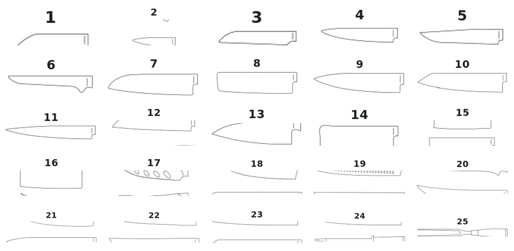

# Knife Shapes and Their Uses

A wall of kitchen knives can look like a collection of unfamiliar names. The simplest way to understand it is not to begin with nationality or tradition, but with work: **What must be cut, and how should the blade move?**

Most cooks repeatedly need only a few families of tools. A general-purpose knife works on the board. A carving knife makes long, clean slices. A boning or fillet knife follows bones. A bread knife crosses a hard crust without crushing the crumb. A paring knife controls small work. A heavy chopper tolerates impact that would damage a thin blade.

Names such as gyuto, santoku, sujihiki, yanagiba, deba and honesuki become useful only after these families are clear. They describe particular traditions and solutions, not a hierarchy of quality.

## Begin with movement, not with names

A knife shape is a physical suggestion. Its edge, height, length and point encourage some movements and discourage others.

- A **rocking cut** keeps part of the edge close to the board while the blade travels in an arc. A curved belly helps.
- A **push cut** moves forward and down. A flatter working edge makes full board contact easier.
- A **vertical chop** moves mainly downward. Tall, fairly flat blades give clearance and control.
- A **draw slice** pulls a long section of edge through food in one smooth movement. Long, narrow blades reduce drag.
- A **detail cut** uses the point for trimming, scoring or working around small joints.

First name the movement; then look for the profile that supports it.

## The families most cooks meet first

| Family | Recognizable shape | Main work | Important limit |
|---|---|---|---|
| Chef's knife | Broad heel, pointed tip, curved or gently curved edge | General board preparation | Not a bone chopper |
| Chinese chef's knife | Tall rectangular blade | Slicing, chopping and transferring food | Thin versions are not cleavers |
| Carving or slicing knife | Long, narrow blade | Clean slices of cooked or raw boneless food | Not for joints or impact |
| Boning or fillet knife | Narrow, pointed; sometimes flexible | Working around bones and skin | Works around bone, not through it |
| Bread knife | Long serrated edge | Bread, cakes and resistant skins | Harder to sharpen on a flat stone |
| Utility, petty or paring knife | Short and controllable | Small ingredients and detail work | Inefficient for large board work |
| Bone chopper | Thick, heavy blade and robust edge | Joints, suitable bones and impact work | Too thick for delicate slicing |

<figure class="kb-learning-figure" data-visual-id="VIS-SHAPES-01">
  
  <figcaption>Twenty-five profiles from the Xinzuo range, shown without language embedded in the image. The numbers correspond to the legend below.</figcaption>
</figure>

1. Turning paring knife
2. Paring knife
3. Flat-cut paring knife
4. Utility knife
5. Steak knife
6. Boning knife
7. Santoku
8. Nakiri
9. Chef's knife
10. Bunka
11. Classic carving knife
12. Bread knife
13. Deba
14. Bone chopper
15. Chinese chef's knife
16. Cheese knife
17. Frozen-food knife
18. Granton-edge carving knife
19. Ham slicer
20. Curved roast-carving knife
21. Yanagiba or sashimi knife
22. Sakimaru slicer
23. Kiritsuke
24. Honing rod
25. Carving fork

The illustration is a map, not a shopping list. Several shapes overlap in use, and many kitchens need only a general-purpose knife, a bread knife and one small knife.

## General-purpose board knives

### Western chef's knife

The familiar chef's knife has a broad heel, useful knuckle clearance and a pointed front. Many examples have enough curve for comfortable rocking, although modern profiles vary from strongly curved to quite flat.

It handles vegetables, herbs, fruit, boneless meat and most daily preparation. Its great advantage is not perfection at one task but competence at many. It is usually the safest starting point for someone who wants one serious knife.

Do not confuse versatility with invulnerability. A chef's knife should not be twisted in frozen food, used as a screwdriver or struck through hard bones.

### Chinese chef's knife

The Chinese chef's knife, often called a **cai dao**, has a tall rectangular blade. The English word “cleaver” can be misleading: many cai dao are thin all-purpose slicers, not bone choppers.

The tall face guides against the knuckles, crushes garlic and moves prepared food toward the pan or wok. A user accustomed to a Western knife may initially feel more weight toward the blade, but the shape can perform almost an entire preparation sequence efficiently.

#### A shape explained by the workstation

The rectangular Chinese kitchen knife is easy to remember when we imagine the work around a wok. Ingredients are sliced, shredded and gathered; the broad face then carries them from board to heat. The silhouette became an emblem of Chinese cooking because it is versatile, not because every rectangular knife was made to break bone.

A true bone chopper shares the outline but has more mass, greater thickness and a stronger edge. Check the construction and intended use before applying impact.

### Japanese all-purpose variations

Japanese makers adapted the general board knife into several recognizable profiles. These are useful choices, but they are variations within the larger all-purpose family.

- The **gyuto** is the closest Japanese counterpart to a chef's knife. It is often slimmer and may have a flatter heel, but profiles range from push-cut oriented to comfortably curved.
- The **santoku** is usually shorter and taller relative to its length. It feels approachable in small kitchens and suits chopping and push cutting.
- The **bunka** resembles a compact santoku but ends in an angular K-tip that helps with precise point work. That fine point should not be twisted or driven hard into the board.
- A modern double-bevel **kiritsuke or K-tip gyuto** is a long all-purpose knife with a straighter working edge and angular point. It is not automatically the same as the traditional single-bevel kiritsuke used in Japanese professional kitchens.

#### Historical connection: a domestic knife for a changing kitchen

The santoku is associated with twentieth-century Japanese home cooking. Its useful story is not a mythical single inventor, but a change in purpose: characteristics of Japanese vegetable knives and Western-influenced general knives were brought together in a compact domestic tool. History helps explain why the santoku feels familiar yet does not fit neatly into an old specialist category.

## Carving and slicing knives

“Carving knife” and “slicing knife” are often used for overlapping products. Both describe a long, narrow blade made to cross a roast, ham, poultry breast, boneless meat or fish with fewer strokes than a chef's knife. Less blade area touches the food, so there is usually less drag.

The essential technique is a long draw slice. Let the sharp edge travel; repeated short sawing usually leaves a rougher surface.

### Classic carving knife

The classic carving knife has a long, fairly straight and narrow blade, often with a pointed tip. It is the familiar partner to a carving fork at the table. Some models have modest flexibility; others are quite rigid. A Granton or dimpled face may reduce sticking, but sharpness and good technique matter more than the decoration.

This is the most useful meaning of **carving knife** throughout this book.

### Curved roast-carving knife

Some carving knives intended especially for roasts and large cooked meats have a more pronounced, sabre-like curve. The raised point and curved edge help the user enter around a joint, follow the surface of a roast and finish a slice with a smooth sweeping motion.

The curve does not turn the knife into a chopper. It is still a slicing tool for cooked meat, not a substitute for a cleaver or boning knife.

### Sujihiki: the Japanese counterpart

The Japanese **sujihiki** is a long, narrow, normally double-bevel slicer. In shops and manufacturers' catalogues it is often described in English as a **slicer** or **carving knife**. That is useful terminology: for a general reader, it belongs to the carving family before it belongs to a dictionary of Japanese names.

Compared with many European carving knives, a sujihiki often has a slimmer profile, less curve and a fine point. Compared with the curved roast-carving form, it encourages a straighter pull through the food rather than a sweeping arc. Its double-bevel edge works naturally for right- and left-handed users and handles roast meat, raw boneless meat and many fish preparations.

| Form | Movement it encourages | Best remembered as | Main distinction |
|---|---|---|---|
| Classic carving knife | Long, controlled draw | General roast and boneless-meat slicer | Familiar Western table and kitchen form |
| Curved roast-carving knife | Draw with a gentle sweeping finish | Roast specialist | Sabre-like curve follows rounded food |
| Sujihiki | Long, relatively straight draw | Japanese carving/slicing counterpart | Usually slim, less curved and double bevel |
| Yanagiba | Single long pulling cut | Japanese raw-fish specialist | Usually single bevel and handed |

### Yanagiba and other specialist slicers

The **yanagiba** is a traditional Japanese single-bevel knife optimized for sashimi and other precise raw-fish slices. Its long edge supports one smooth pull, while its geometry helps separate the slice cleanly. It requires more skill, tends to steer and is normally made in right- and left-handed versions.

Ham and salmon slicers are Western specialist variations, often very long and narrow; some are flexible. A sakimaru is a Japanese specialist slicer with a distinctive sword-like point. These tools make sense when their particular task is frequent. For mixed household use, a sharp double-bevel carving knife is usually easier.

> Remember the family first: carving knife. Sujihiki is the Japanese double-bevel counterpart; yanagiba is the more specialized single-bevel raw-fish knife.

## Boning, filleting and fish butchery

### Western boning and fillet knives

A Western boning knife has a narrow, pointed blade. A stiff version offers control around beef or pork joints; a flexible version follows contours more easily. A fillet knife is usually narrower and more flexible so it can travel close to fish bones and skin.

Flex is not a sign of weakness or quality by itself. It is a design decision: useful for following a curve, less useful when exact rigidity is needed. Both knives are meant to work **around** bone rather than chop through it.

### Japanese specialist cases

The **honesuki** is a stiff, triangular Japanese boning knife associated especially with poultry. Its strong heel and point find joints and separate connective tissue. It is generally less flexible than a Western boning knife.

The **deba** is a thick, heavy, usually single-bevel knife developed for fish butchery. The heel can work through suitable fish joints and bones; the front performs finer work. Its weight does not make it a universal cleaver for large mammal bones.

These are specialist alternatives, not required upgrades from Western boning and fillet knives.

## Vegetable knives

A chef's knife, Chinese chef's knife or santoku can prepare vegetables extremely well. Dedicated vegetable knives become useful when a cook wants more straight-edge contact, blade height or specialized presentation technique.

The Japanese **nakiri** is a thin, tall, rectangular double-bevel knife. Its fairly straight edge is excellent for vertical chopping and push cuts. It may resemble a small cleaver, but it is not made for bone.

The **usuba** looks related but is a traditional single-bevel specialist. It supports advanced vegetable work such as continuous sheet peeling and fine decorative cuts. It steers more, is handed and needs geometry-specific sharpening. It is not simply a “better nakiri.”

## Small knives

A **utility knife** is a compact general tool for small board tasks, sandwiches, fruit, cheese and trimming. The Japanese term **petty** is often used for a similar small, versatile profile. Longer examples work mainly on the board; shorter ones can also handle some in-hand tasks.

A **paring knife** is shorter and designed for control close to the hand: peeling, coring, removing blemishes and decorative work. A curved turning knife helps shape small vegetables, while a flat-cut paring form makes short straight cuts.

> A utility or petty knife is a small general-purpose tool. A paring knife is the shorter detail specialist.

## Serrated and special-purpose knives

A **bread knife** uses teeth to enter a resistant crust while placing less pressure on the soft crumb. It also works well on cakes, pastries and some soft foods with firm skins. Serrations remain usable for a long time, but they need a tapered sharpener or specialist service rather than ordinary flat-stone strokes.

A **cheese knife**, **frozen-food knife** or other task-specific form should be chosen because the task is frequent, not because its silhouette is interesting. Frozen food is particularly hazardous to thin, hard blades: only use a knife explicitly designed for it.

A **bone chopper** is thick, heavy and robust. Its obtuse edge and mass trade delicate slicing ability for impact tolerance. Even then, technique and the size and type of bone still matter.

## How the profile changes the experience

The category name is only a starting point. Compare the actual knife in front of you.

- **Edge curvature:** more belly supports rocking; a flatter section supports push cutting and chopping.
- **Length:** more length allows a longer slice, but needs a larger board and more control.
- **Blade height:** more height gives knuckle clearance and a broad guiding surface; less height reduces drag in a slice.
- **Thickness behind the edge:** thin geometry cuts easily; stronger geometry tolerates rougher work but can wedge more.
- **Point:** a fine point helps detail work but requires care. A rounded or absent point simplifies straight chopping.
- **Balance and weight:** blade-forward tools can feel powerful; lighter or handle-balanced tools can feel agile. Neither is universally better.

## Choosing a first serious knife

For most users, the first serious knife should be versatile. Begin with ingredients, board size and movement, then compare steel, handle and construction.

- Choose a **chef's knife** if you want a familiar all-purpose shape and enjoy some rocking.
- Choose a **Chinese chef's knife** if you want height, efficient chopping and a broad face for transferring food.
- Consider a **gyuto, santoku or bunka** when that Japanese variation better matches your preferred length, curve and point.
- Add a **carving knife** when you often portion roasts, ham, boneless meat or fish. A sujihiki is one refined Japanese expression of this family.
- Add specialist forms such as yanagiba, usuba or deba only when you repeatedly perform the technique for which they were designed.

Xinzuo makes these profiles in different steels and constructions because shape and material solve different parts of the problem. Choose the profile for the movement; then use the [Xinzuo Blade Steels](../02-steels-and-metallurgy/xinzuo-blade-steels.md) and [Xinzuo Handle Materials](../02-steels-and-metallurgy/xinzuo-handle-materials.md) chapters to choose the balance of edge behaviour, maintenance, weight and feel.

## Common misunderstandings

### “A Chinese chef's knife is a bone cleaver”

Many are thin slicers. Use impact only with a model explicitly built as a bone chopper.

### “Carving knife and sujihiki are unrelated”

They come from different design traditions, but solve the same broad problem: long, clean slices through boneless food. “Sujihiki” is often presented commercially as a slicer or carving knife.

### “Every Japanese shape is more advanced”

Specialization is not automatic superiority. A single-bevel yanagiba or usuba can be extraordinary at its intended work and less convenient for an inexperienced general user.

### “Every chef's knife is ideal for rocking”

The actual edge curve, not the printed category, determines how naturally the knife rocks.

## What to remember

> Start with the work: general preparation, carving, boning, bread, detail or impact. Then choose the profile that makes the correct movement easier.

Tradition adds useful solutions and stories, but the best knife is not the one with the most impressive foreign name. It is the one whose shape makes normal work cleaner, safer and more controlled.

> **Practice principle:** family first, movement second, specialist name third.

### Historical and terminology sources

- [Wüsthof, choosing and using a carving knife](https://wusthof.com/blogs/the-chefs-table/right-knife-for-the-job-carving-knife)
- [Wüsthof, Gourmet carving knife](https://wusthof.com/products/wusthof-gourmet-8-carving-knife-1025048820)
- [Zwilling, slicing and carving knife](https://www.zwilling.com/us/zwilling-pro-8-inch-slicing%2Fcarving-knife-38400-203/38400-203-0.html)
- [Tojiro, Slicer (Sujihiki)](https://www.tojiro-japan.com/item/slicer_sujihiki/)
- [Tojiro, Western-style knife categories](https://www.tojiro-japan.com/knife_category/western_style_knives/)
- [KOGEI JAPAN, Sakai Forged Blades](https://kogeijapan.com/locale/en_US/sakaiuchihamono/)
- [Government of Japan, a knife-shop owner and Japanese craftsmanship](https://www.japan.go.jp/tomodachi/2020/summer2020/a_canadian_knife_shop_owner.html)
