# Xinzuo Knife Shape Atlas

The Xinzuo catalog contains familiar Western profiles, Japanese general-purpose and specialist forms, Chinese slicing and chopping knives, and a small number of Xinzuo-specific commercial names. This atlas brings them into one educational system without pretending that every label is a universal standard.

Each entry places two visuals directly below the form name:

- an **original normalized silhouette**, which makes profile differences easier to compare;
- a **Xinzuo catalog example**, which shows how the form appears in a real series.

The silhouettes are intentionally not a scale drawing. Length, spine thickness, grind, balance and edge geometry still vary between models. Before recommending any knife for bones, frozen food or single-bevel work, check the exact current model specification.

## The essential distinction: gyuto and Western chef's knife

Modern gyuto and Western chef's knives overlap heavily in use, but the two Xinzuo catalog labels should remain separate.

| Feature | Gyuto | Western chef's knife |
|---|---|---|
| **Typical Xinzuo profile** | Slightly flatter edge through the heel and middle; slimmer, more pointed outline | More continuous belly and a broader, more robust-looking heel-to-tip profile |
| **Natural motion** | Push cuts, draw slices and moderate rocking | Rocking, chopping and general board work |
| **Visual emphasis** | Lighter, more precise and less visibly meat-oriented | More substantial all-purpose profile historically associated with European professional kitchens |
| **Important limit** | Not every gyuto is flat or thin | Not every Western chef's knife is strongly curved or heavy |

The useful customer explanation is therefore not “Japanese versus Western quality.” It is: **compare the actual curve, height, thickness and balance**. A flatter gyuto normally completes push cuts more cleanly; a more curved Western chef's knife normally gives more clearance for a long rocking stroke.

## Small, table and precision knives

### Curved paring profile

  <figure>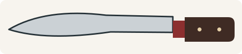<figcaption>Profile icon: curved paring family.</figcaption></figure>
  <figure>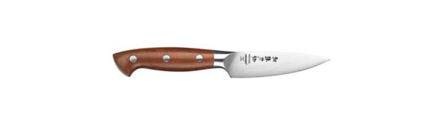<figcaption>Xinzuo catalog example; exact curve varies by series.</figcaption></figure>

This is the more curved of the two profiles that the catalog calls simply **Paring Knife**. The compact blade is controlled mainly with the fingers and is useful for peeling, coring, removing blemishes and shaping small ingredients. A pronounced curve can follow rounded fruit and vegetable surfaces efficiently, but it provides less straight-edge contact on a board. It is not a miniature chef's knife and should not be forced through hard pits, joints or frozen food.

### Straight paring profile

  <figure>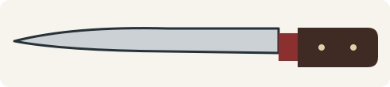<figcaption>Profile icon: straight paring family.</figcaption></figure>
  <figure>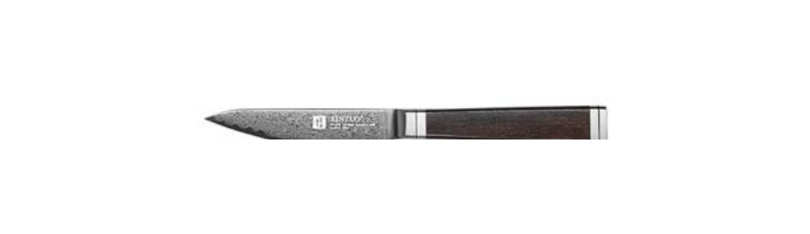<figcaption>Xinzuo catalog example with a straighter working edge.</figcaption></figure>

The straighter paring profile gives more usable edge contact for short board cuts and precise trimming. It is effective for shallots, garlic, fruit, small vegetables and garnish work, while remaining short enough for controlled in-hand use. Compared with the curved version it tracks a straight cut more naturally, but it does not wrap around rounded produce as readily. The catalog uses the same `Paring Knife` label for both versions, so photographs and profile matter more than the name alone.

### Flat-cut paring knife

  <figure>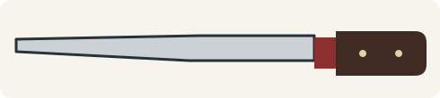<figcaption>Profile icon: flat-cut paring knife.</figcaption></figure>
  <figure><figcaption>Catalog profile reference for the dedicated flat-cut label.</figcaption></figure>

Xinzuo separates this compact, almost level-edged form as **Flat Cut Paring Knife**. Its straight working edge favors tiny board cuts, mincing small aromatics and making clean squared cuts in fruit or vegetables. It sacrifices some of the sweeping contact of a curved parer and has less knuckle clearance than a taller knife. It is best presented as a precision tool rather than a universal utility knife.

### Utility knife

  <figure>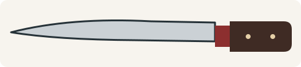<figcaption>Profile icon: standard utility knife.</figcaption></figure>
  <figure>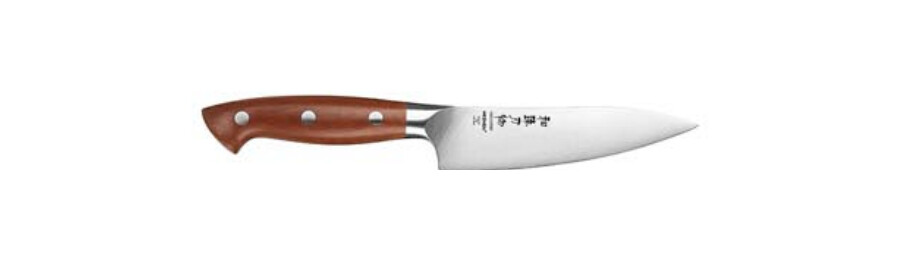<figcaption>Xinzuo utility knife example.</figcaption></figure>

The utility knife fills the space between a paring knife and a chef's knife. Its extra reach is useful for fruit, sandwiches, small vegetables, cheese, portioning boneless meat and quick preparation when a full-size knife feels unnecessary. The narrower blade remains agile but gives less knuckle clearance and food-transfer area than a chef, santoku or nakiri. Xinzuo series include several lengths, so “utility” describes a role rather than one fixed size.

### Ultimate Utility Knife — Xinzuo commercial profile

  <figure>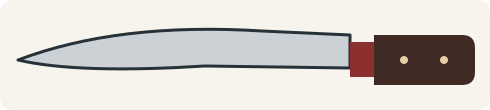<figcaption>Profile icon: Xinzuo Ultimate Utility profile.</figcaption></figure>
  <figure>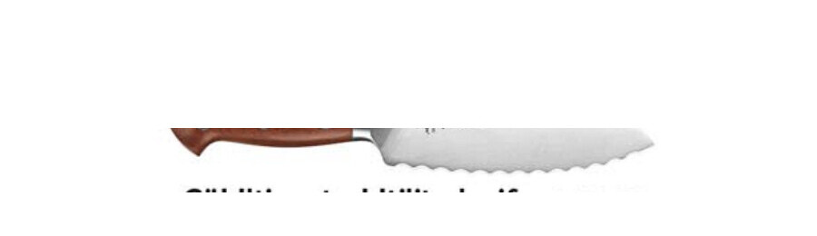<figcaption>Xinzuo catalog example with a scalloped cutting edge.</figcaption></figure>

`Ultimate Utility Knife` is a catalog-specific name, not an international knife category. In the Xinzuo X02 and X02M families it identifies a medium-length multipurpose profile with a scalloped edge. It is intended to bridge table, sandwich, soft-crust and small-preparation work. The teeth continue cutting when a plain edge would need immediate maintenance, but they do not replace a long bread knife and are less convenient to sharpen at home. Product copy should always connect the name to the exact Xinzuo model rather than defining a universal taxonomy.

### Steak knife

  <figure>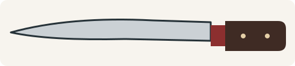<figcaption>Profile icon: steak knife.</figcaption></figure>
  <figure>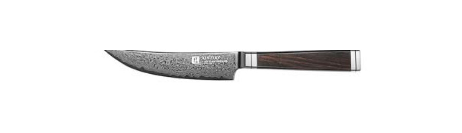<figcaption>Xinzuo table-size steak knife example.</figcaption></figure>

A steak knife is a table knife designed to portion cooked meat cleanly on the plate. Xinzuo offers plain-edge examples; the current model edge should always be checked because straight and serrated steak knives behave differently. A sharp plain edge can leave a cleaner cut surface, while serrations tolerate plate contact longer. Neither version should be used as a small boning knife: the blade and table-oriented geometry are not designed for prying around hard joints.

### Butter knife

  <figure><figcaption>Profile icon: butter knife.</figcaption></figure>
  <figure>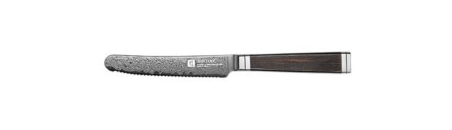<figcaption>Xinzuo rounded-tip butter knife example.</figcaption></figure>

The butter knife has a blunt or gently rounded point and a non-aggressive working edge. It spreads butter, soft cheese, pâté, preserves and condiments without the piercing tip of a preparation knife. Its safe-looking outline does not make every edge harmless, so the exact model should still be handled as cutlery. It belongs to service and presentation rather than chopping, boning or general board work.

### Cheese knife

  <figure><figcaption>Profile icon: representative cheese knife.</figcaption></figure>
  <figure><figcaption>One of several Xinzuo cheese profiles.</figcaption></figure>

“Cheese knife” is a family rather than one geometry. Xinzuo catalog pages show short pointed forms and perforated or relieved blades intended to reduce contact with soft cheese. A narrow point can portion or serve small pieces; openings and reduced blade area can lessen drag, although no feature prevents sticking in every cheese. Hard aged cheese may need a stronger, shorter tool, while soft cheese benefits from a thin, low-contact blade. Match the specific profile to the texture instead of treating every cheese knife as interchangeable.

## General-purpose and vegetable knives

### Western chef's knife

  <figure>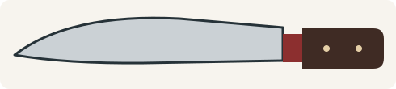<figcaption>Profile icon: Western chef's knife.</figcaption></figure>
  <figure>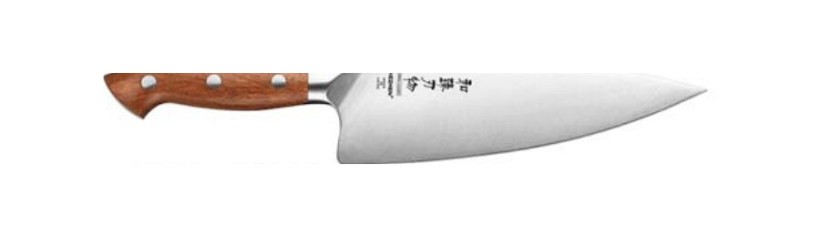<figcaption>Xinzuo catalog example with a pronounced belly.</figcaption></figure>

The Western chef's knife is a broad all-purpose form with a pointed tip and, commonly, a visibly curved belly. The curve supports rocking through herbs and repeated board work; the heel provides height for chopping and guiding against the supporting hand. Compared with the Xinzuo gyuto examples, the outline is normally broader and more continuously curved, giving it a more substantial, traditionally meat-oriented appearance. That does not make it a bone knife: the fine cutting edge is intended for boneless meat, vegetables, fruit and herbs, not hard impact.

### Gyuto

  <figure>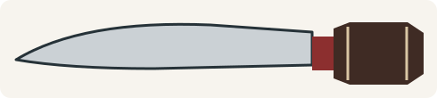<figcaption>Profile icon: gyuto.</figcaption></figure>
  <figure>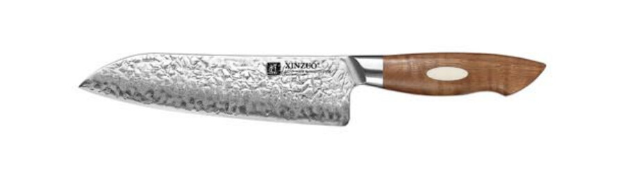<figcaption>Xinzuo gyuto example with a flatter middle section.</figcaption></figure>

The gyuto is the Japanese all-purpose counterpart to the chef's knife. Xinzuo catalog examples generally show a slightly flatter edge through the heel and middle, a slimmer point and less of the broad, meat-cleaver-like visual mass sometimes associated with a Western chef profile. That makes push cutting and draw slicing feel natural while still allowing moderate rocking near the front. The distinction is a tendency, not a rule: some gyuto are curved and some Western chef's knives are comparatively flat. Choose by the actual profile, thickness, length and balance.

### Santoku

  <figure>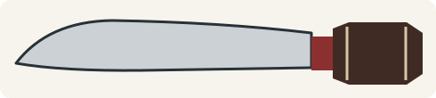<figcaption>Profile icon: santoku.</figcaption></figure>
  <figure>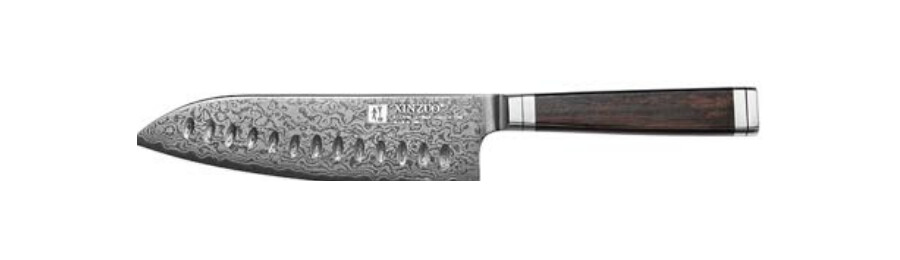<figcaption>Xinzuo santoku example.</figcaption></figure>

The santoku is a compact, tall all-purpose knife. Its straighter edge and lowered tip favor chopping, push cutting and controlled slicing, while the blade height offers useful knuckle clearance. It is approachable in small kitchens and for users who find a long chef's knife unwieldy. Its shorter edge needs more strokes on large roasts, melons or long fish portions, and very flat examples do not support an exaggerated rocking motion. Granton-style hollows, where present, may reduce some sticking but do not create an air cushion or eliminate adhesion.

### Bunka

  <figure>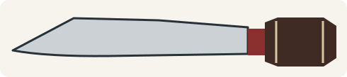<figcaption>Profile icon: bunka with K-tip.</figcaption></figure>
  <figure>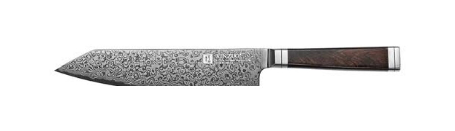<figcaption>Xinzuo bunka example.</figcaption></figure>

The bunka combines santoku-like blade height and compact control with an angular K-tip. The relatively straight edge favors push cuts and chopping; the point adds precision for scoring, trimming and navigating small details. The tip is also the form's most vulnerable area. It should not be twisted, used to lever food apart or driven repeatedly into the board during a wide rocking stroke. Recommend a bunka to users who value a precise tip and flatter cutting motion, not simply because its silhouette looks dramatic.

### Nakiri

  <figure>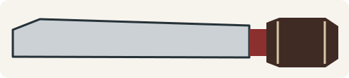<figcaption>Profile icon: nakiri.</figcaption></figure>
  <figure>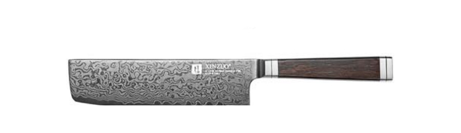<figcaption>Xinzuo thin vegetable-knife example.</figcaption></figure>

The nakiri is a tall, thin, double-bevel vegetable knife with a nearly straight cutting edge. It gives excellent board contact for push cuts and vertical chopping and offers a broad face for guiding food. Its rectangular outline can be mistaken for a cleaver, but a nakiri is not designed for bones or impact. The thin edge that makes it efficient in cabbage, onions, carrots and leafy vegetables is precisely why it should not be used like a chopper.

### Viking Knife — Xinzuo commercial profile

  <figure>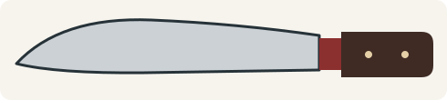<figcaption>Profile icon: Xinzuo Viking profile.</figcaption></figure>
  <figure>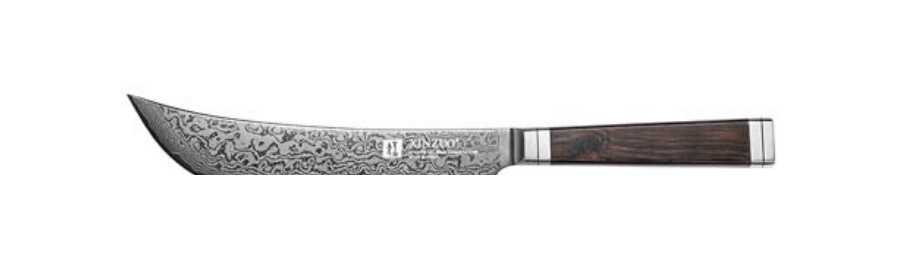<figcaption>Xinzuo catalog example; the name is product-specific.</figcaption></figure>

`Viking Knife` is a Xinzuo commercial name for a tall, compact all-purpose profile with a strongly swept front. It sits visually between a compact chef's knife, a santoku and a curved chopping form. The generous height supports knuckle clearance and food transfer; the belly permits more rocking than a flat nakiri. It should not be presented as a historic Nordic taxonomy or as permission to chop bones. Describe the exact Xinzuo model, length and construction whenever the name is used.

### Granton-edge chef's knife

  <figure><figcaption>Profile icon: chef's knife with edge hollows.</figcaption></figure>
  <figure>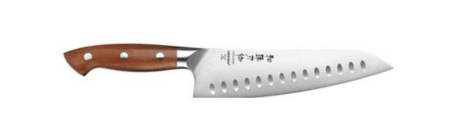<figcaption>Xinzuo chef profile with alternating hollows.</figcaption></figure>

This is a chef's-knife profile with machined hollows along the blade face. The hollows can reduce contact area and sometimes make slices release more readily, especially with moist or starchy ingredients. Their effect depends on depth, position, surface finish and the food; they do not guarantee non-stick performance. The underlying chef profile still determines cutting motion. It should be sharpened as a chef's knife, while avoiding unnecessary thinning into the hollows.

## Boning, filleting and long slicing

### Western boning knife

  <figure>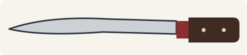<figcaption>Profile icon: Western boning knife.</figcaption></figure>
  <figure>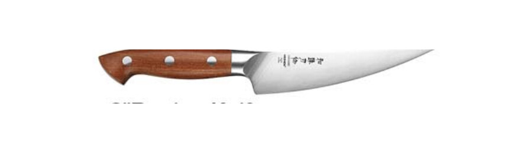<figcaption>Xinzuo narrow boning profile.</figcaption></figure>

A Western boning knife has a narrow blade and a pointed tip for entering joints, trimming connective tissue and separating meat from bone. Stiff versions give control around beef and pork; more flexible versions follow curves more readily. The name means working **around** bones, not chopping through them. Twisting a fine point or striking hard bone can damage the edge even when the blade feels comparatively robust.

### Honesuki

  <figure>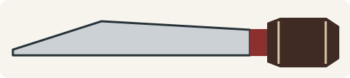<figcaption>Profile icon: honesuki.</figcaption></figure>
  <figure>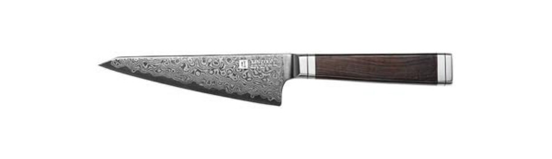<figcaption>Xinzuo triangular poultry-boning example.</figcaption></figure>

The honesuki is a triangular Japanese boning knife strongly associated with poultry. Its pointed front locates joints and traces around bones, while the stronger heel handles controlled separation of connective tissue. It is normally stiffer than a flexible Western fillet knife. Some honesuki use asymmetrical edge geometry, so handedness and sharpening instructions must be checked by model. It is a jointing and trimming tool, not a miniature bone chopper.

### Fillet knife

  <figure><figcaption>Profile icon: flexible Western fillet knife.</figcaption></figure>
  <figure>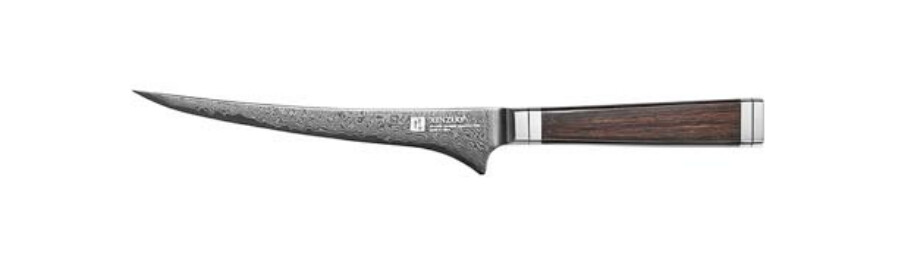<figcaption>Xinzuo narrow fillet profile.</figcaption></figure>

The Western fillet knife is long, narrow and commonly flexible. Flex allows the edge to follow ribs, skin and the contours of a fish while minimizing waste. It differs from a long sashimi slicer, which relies on rigidity and a long draw cut to create a finished slice. Flexibility is not permission to bend the blade sharply or twist it against hard bone; it is controlled compliance for contour work.

### Carving knife

  <figure>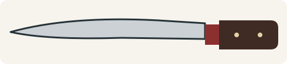<figcaption>Profile icon: carving knife.</figcaption></figure>
  <figure>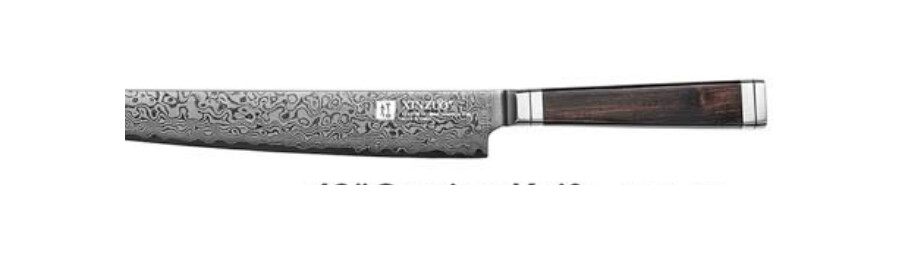<figcaption>Xinzuo long carving example.</figcaption></figure>

A carving knife is longer and narrower than a general chef's knife so that cooked meat, poultry, large fruit or boneless roasts can be portioned with fewer strokes. Reduced blade height lowers drag and makes the cut easier to see. It works best with a draw slice rather than heavy vertical chopping. Length should match the food and board: too short creates sawing; unnecessarily long can feel difficult to control.

### Roast carving knife

  <figure>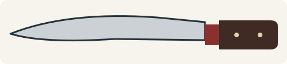<figcaption>Profile icon: roast carving profile from the catalog chart.</figcaption></figure>
  <figure>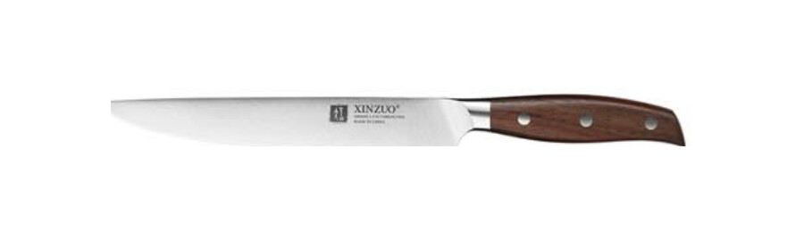<figcaption>Xinzuo long slicing example representing the roast-carving family.</figcaption></figure>

The catalog's **Roast Carving Knife** has a broader, more upswept point than the narrow standard carving profile. The extra belly can make it comfortable when the slicing stroke rises through a large roast, while the long edge still aims to finish a portion in one or two draws. It remains a slicer for cooked, boneless food. The broader tip should not be interpreted as a joint breaker or impact tool.

### Granton carving knife

  <figure><figcaption>Profile icon: Granton carving knife.</figcaption></figure>
  <figure>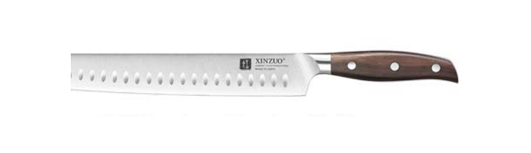<figcaption>Xinzuo long slicer with blade-face hollows.</figcaption></figure>

The Granton carving knife keeps the long, narrow slicing geometry and adds a line of hollows intended to reduce blade contact. These can help with ham, cooked meat, large fruit or soft food, but release still depends on technique and ingredient. The hollows are not serrations: the cutting edge remains plain and is maintained accordingly. Use long draw slices and avoid a short back-and-forth sawing action whenever the food allows.

### Ham knife

  <figure>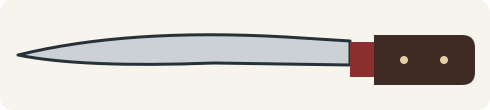<figcaption>Profile icon: ham knife.</figcaption></figure>
  <figure>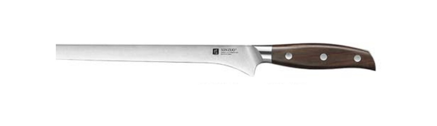<figcaption>Xinzuo long ham-slicing example.</figcaption></figure>

A ham knife is an extra-long, narrow slicer for producing broad, thin slices with minimal sawing. Some examples are slightly flexible so the blade can follow the surface of a ham; others are firmer. The narrow blade reduces resistance and helps preserve a smooth cut face. It is less suitable than a chef's knife for chopping and less suitable than a fillet knife for tight work around fish bones.

## Serrated and hard-food specialists

### Bread knife

  <figure><figcaption>Profile icon: bread knife.</figcaption></figure>
  <figure>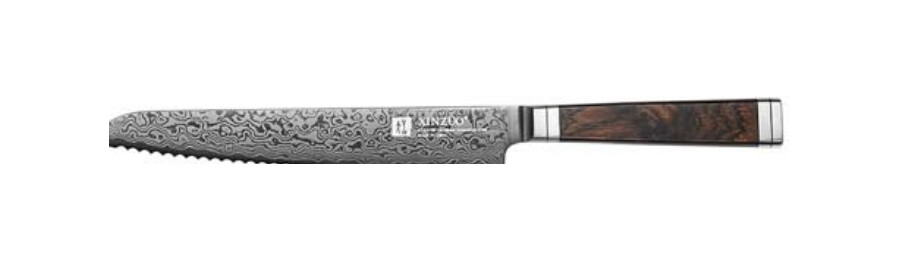<figcaption>Xinzuo long serrated bread knife.</figcaption></figure>

A bread knife uses a long serrated edge to enter a firm crust while limiting compression of the soft interior. It is also useful for cakes, pastries and some tough-skinned produce. The cut should be guided with light pressure; forcing the blade can tear the crumb and reduce control. Serration pattern and blade length matter, and routine home sharpening is more specialized than for a plain edge.

### Frozen-food knife

  <figure><figcaption>Profile icon: frozen-food knife.</figcaption></figure>
  <figure>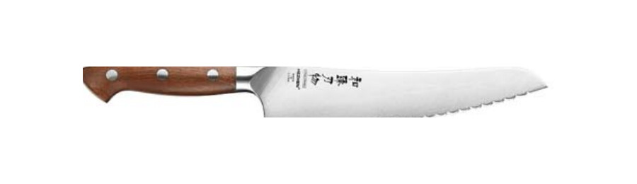<figcaption>Xinzuo catalog example with a coarse scalloped edge.</figcaption></figure>

Xinzuo's frozen-food profile uses a strong, coarse serration to saw through suitable frozen ingredients. This is a specialist operation: frozen food is hard, slippery and unpredictable, and not every knife labeled for it is suitable for every block, bone or package. Keep the product stable, keep the free hand out of the cutting path and never use twisting impact. A frozen-food knife is not a bone chopper, and a standard chef's knife should not be substituted for it.

## Chinese and heavy blades

### Chinese slicing knife

  <figure><figcaption>Profile icon: Chinese slicing knife.</figcaption></figure>
  <figure>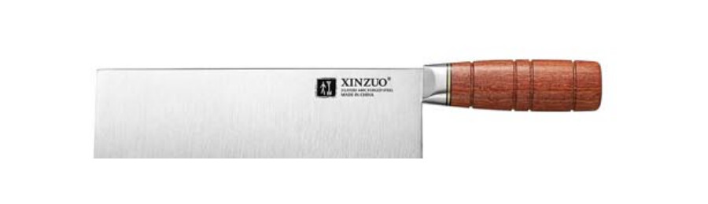<figcaption>Xinzuo X07 Chinese slicing profile.</figcaption></figure>

A Chinese slicing knife can look like a cleaver while being relatively thin behind the edge. The tall blade provides knuckle clearance, a long straight working edge and a broad surface for guiding and transferring food. It excels at vegetables, boneless meat and fast board work. Its rectangular appearance is not proof of impact strength: a thin slicer should never be used on hard bones simply because it resembles a chopper.

### Cleaver

  <figure><figcaption>Profile icon: cleaver family.</figcaption></figure>
  <figure>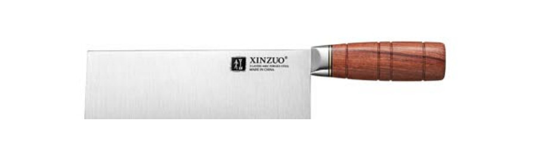<figcaption>Xinzuo X07 cleaver example.</figcaption></figure>

`Cleaver` is used broadly in the catalog and must be interpreted with the exact model. Some cleavers are general Chinese kitchen knives; others are thicker and more impact-tolerant. Weight, spine thickness, edge angle and the manufacturer's intended material determine whether a blade is appropriate for cartilage, small bones or only boneless preparation. Never infer bone capability from height alone.

### Chopper

  <figure><figcaption>Profile icon: chopper.</figcaption></figure>
  <figure>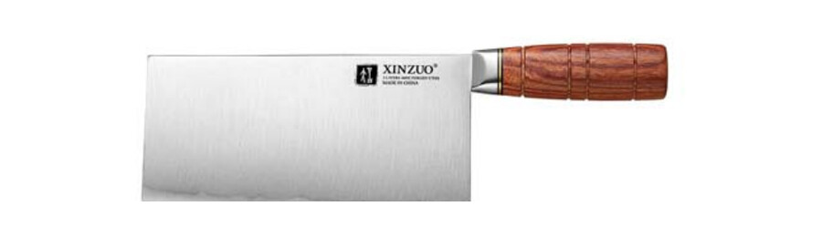<figcaption>Xinzuo X07 chopper example.</figcaption></figure>

The catalog's chopper is a tall, weight-forward profile intended for stronger downward work than a thin Chinese slicer. A chopper normally trades some low-resistance slicing performance for edge support and momentum. That still does not make every chopper suitable for every bone. Use the exact Xinzuo model guidance, strike squarely and avoid twisting the edge in hard material.

### Bone chopper

  <figure><figcaption>Profile icon: bone chopper.</figcaption></figure>
  <figure>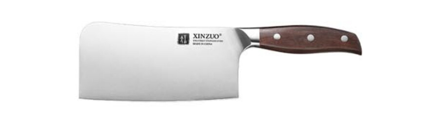<figcaption>Xinzuo heavy bone-chopper example.</figcaption></figure>

The bone chopper is the most explicitly impact-oriented form in the atlas. Its tall, heavy blade and supported edge are intended for suitable butchery work where mass and durability matter more than a very thin cutting geometry. Capability still has limits: large dense bones, frozen blocks and poor striking technique can damage the knife or injure the user. Use a stable board, a clear cutting line and no sideways levering. Do not substitute a nakiri, Chinese slicer or thin cleaver.

## Traditional and specialist Japanese fish forms

### Deba

  <figure>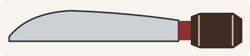<figcaption>Profile icon: deba.</figcaption></figure>
  <figure>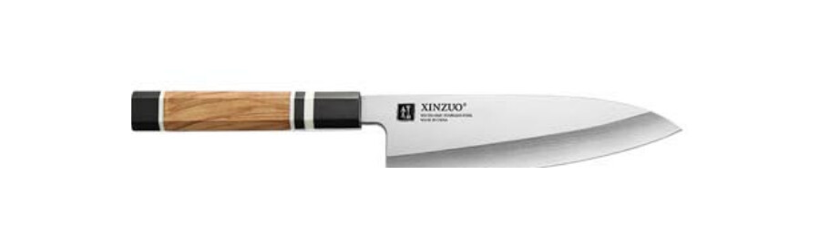<figcaption>Xinzuo F3S deba example.</figcaption></figure>

The deba is a thick, heavy Japanese fish-butchery knife. The strong heel is used for controlled work through appropriate fish joints and bones; the front performs finer separation and filleting. Traditional versions are single bevel and handed, so they steer differently from symmetric knives and require geometry-specific sharpening. A deba is not a universal mammal-bone cleaver, and twisting its edge can still cause chipping.

### Sashimi knife — broad Xinzuo catalog label

  <figure>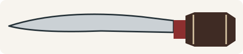<figcaption>Profile icon: long sashimi slicer.</figcaption></figure>
  <figure>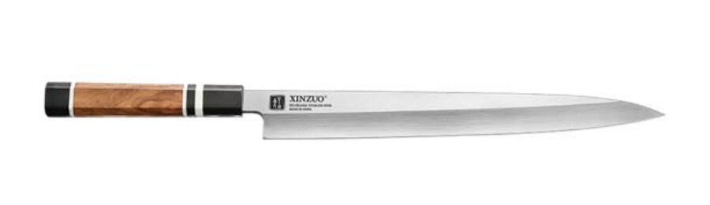<figcaption>Xinzuo F3S long single-bevel slicer.</figcaption></figure>

Xinzuo uses `Sashimi Knife` as a broad commercial label for long, narrow single-bevel fish slicers. The geometry supports one long pulling cut through boneless fish, reducing the surface damage caused by short sawing strokes. In more specific Japanese terminology, profiles within this family may be described more narrowly, for example as yanagiba-type slicers. Because they are commonly handed and can steer, use and sharpening require more training than a double-bevel sujihiki.

### Sakimaru

  <figure>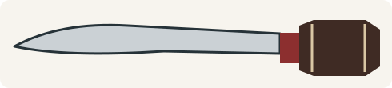<figcaption>Profile icon: sakimaru.</figcaption></figure>
  <figure>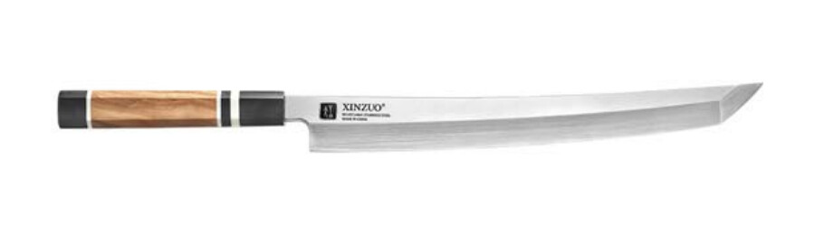<figcaption>Xinzuo F3S sakimaru example.</figcaption></figure>

The sakimaru belongs to the long single-bevel sashimi-slicer family but ends in a rounded, sword-influenced point rather than the more ordinary clipped or pointed front. Its principal function remains a long, clean draw slice through boneless fish; the tip shape mainly changes presentation, front-end handling and detail access. It is not designed for chopping, joints or twisting cuts. Sharpen it according to its single-bevel construction.

### Kiritsuke

  <figure>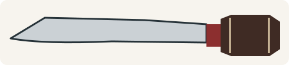<figcaption>Profile icon: catalog kiritsuke profile.</figcaption></figure>
  <figure><figcaption>Xinzuo F3S single-bevel kiritsuke example.</figcaption></figure>

In the specialist F3/F3S catalog context, kiritsuke identifies a long, angular-tipped single-bevel form used for precise slicing and advanced preparation. This must be distinguished from a modern double-bevel K-tip gyuto, which is an accessible all-purpose knife. The traditional form can steer, is usually handed and has a delicate point. Product descriptions should state the bevel construction instead of relying on the silhouette alone.

## Reading catalog names responsibly

The catalog is the authority for what Xinzuo calls a current model. It is not, by itself, proof that a commercial name is a universal historical category. This atlas therefore follows four rules:

1. `Viking Knife` and `Ultimate Utility Knife` remain explicitly Xinzuo commercial names.
2. `Sashimi Knife` is connected to more specific educational terminology without silently renaming the product.
3. `Cleaver`, `Chinese slicing knife`, `chopper` and `bone chopper` stay separate until thickness and intended impact work are confirmed.
4. A silhouette never establishes hardness, grind, handedness or bone capability.

## External technical references

- [Victorinox: Which knife does what](https://www.victorinox.com/en-US/Cutlery/Information/Which-knife-does-what/cms/whichknifedoeswhat/) — external cross-check for Western paring, steak, fillet, bread, carving and santoku roles.
- [KAI Europe: Japanese blade families](https://kai-europe.com/en/keyword/japanese-blades/) — external cross-check for Japanese all-purpose and specialist categories.
- [KAI 2025–26 kitchen-knife catalog](https://kai-europe.com/wp-content/uploads/2025/08/KAI_kitchen_knives_catalogue_2025-26_en.pdf) — manufacturer reference for single-bevel forms, gyuto and current handle terminology.
- [KAI Sekimagoroku Migaki gyuto series](https://kai-europe.com/en/category/kitchen-knives/sekimagoroku-migaki-serie/) — manufacturer example of gyuto as an all-purpose counterpart to the European chef's knife.

*Source note: Xinzuo names, examples and product-family associations come from the 2025 Xinzuo catalog. The normalized icons are original educational diagrams; the product crops remain Xinzuo catalog material and are subject to the image-rights notice.*
